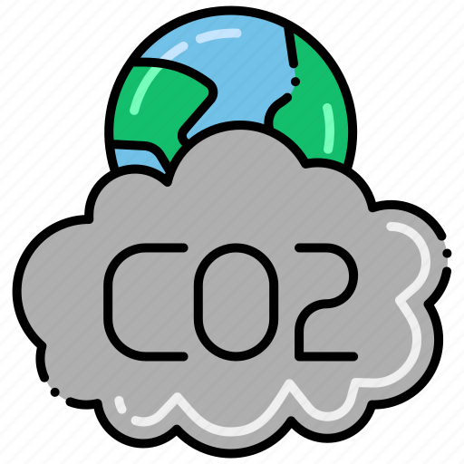

# Global CO2 Emission
## Introduction

In an era marked by heightened environmental consciousness, understanding the dynamics of global carbon dioxide (CO2) emissions becomes paramount for informed decision-making and sustainable policy development. This writing is about going into the world of environmental data embarks on an exploration of the Global CO2 Emissions dataset spanning the years 1750 to 2021, meticulously juxtaposed with corresponding population data for a holistic perspective.
As the earth's climate undergoes unprecedented changes, this dataset serves as a valuable compass, guiding us through the historical evolution of CO2 emissions. From the Industrial Revolution to the present day, we delve into the nuanced interplay of industrial factors that have shaped our planet's carbon footprint. The dataset's rich tapestry invites us to analyze the ebb and flow of emissions, providing insights into how global societies have contributed to, and been affected by, this environmental narrative.

## Key Questions Driving Exploration
Our exploration is framed by key questions, prompting us to uncover pivotal insights:

1. Temporal Shifts in Global Emissions: An investigation into the temporal evolution of CO2 emissions reveals patterns, trends, and anomalies. How have global emissions of CO2 changed over time, and what underlying factors have influenced this trajectory?
2. Annual Emission Leaders: Through a yearly lens, we seek to identify the primary contributors to global CO2 emissions. Who takes the lead each year, and what geopolitical and industrial factors drive these annual variations?
3. Personal Carbon Footprints: Zooming in, we scrutinize where on our planet the average person leaves the most significant carbon footprint. What regions are marked by higher per capita emissions, and what societal and economic factors contribute to this phenomenon?
4. Fossil Fuels and Land Use Dynamics: The dataset opens a gateway to scrutinize the complex relationship between global CO2 emissions, fossil fuel consumption, and land use practices. How have emissions from these sources evolved over time, and what implications do these changes have on our environment?

## Dataset
In order to conduct the analysis, we use the dataset provided by [Maven Analytics](https://mavenanalytics.io/data-playground)

| column |description |
| ------ |------ |
| country |Geographic location. |
| year |Year of observation. |
| iso_code |ISO 3166-1 alpha-3, three-letter country codes. |
| population |Population by country and year. |
| gdp |Gross domestic product measured in international-$ using 2011 prices to adjust for price changes over time (inflation) and price differences between countries. Calculated by multiplying GDP per capita with population. |
| cement_co2 |Annual emissions of carbon dioxide (CO2) from cement, measured in million tonnes. |
| cement_co2_per_capita |Annual CO2 emissions from cement (per capita) - Annual emissions of carbon dioxide (CO2) from cement, measured in tonnes per person. |
| co2 |Annual total emissions of carbon dioxide (CO2), excluding land-use change, measured in million tonnes. |
| co2_growth_abs |Annual growth in total emissions of carbon dioxide (CO2), excluding land-use change, measured in million tonnes. |
| co2_growth_prct |Annual CO2 emissions growth (%) - Annual percentage growth in total emissions of carbon dioxide (CO2), excluding land-use change. |
| co2_including_luc |Annual total emissions of carbon dioxide (CO2), including land-use change, measured in million tonnes. |
| co2_including_luc_growth_abs |Annual growth in total emissions of carbon dioxide (CO2), including land-use change, measured in million tonnes. |
| co2_including_luc_growth_prct |Growth rate of emissions including land-use change (%) - Annual percentage growth in total emissions of carbon dioxide (CO2), including land-use change. |
| co2_including_luc_per_capita |Annual CO2 emissions including land-use change per capita - Annual emissions of carbon dioxide (CO2), including land-use change, measured in tonnes per person. |
| co2_including_luc_per_gdp |Annual CO2 emissions including land-use change per GDP - Annual total emissions of carbon dioxide (CO2), including land-use change, measured in kilograms per dollar of GDP (2011 international-$). |
| co2_including_luc_per_unit_energy |Annual CO2 emissions including land-use change per unit energy - Annual total emissions of carbon dioxide (CO2), including land-use change, measured in kilograms per kilowatt-hour of primary energy consumption. |
| co2_per_capita |Annual CO2 emissions (per capita) - Annual total emissions of carbon dioxide (CO2), excluding land-use change, measured in tonnes per person. |
| co2_per_gdp |Annual CO2 emissions per GDP (kg per international-$) - Annual total emissions of carbon dioxide (CO2), excluding land-use change, measured in kilograms per dollar of GDP (2011 international-$). |
| co2_per_unit_energy |Annual CO2 emissions per unit energy (kg per kilowatt-hour) - Annual total emissions of carbon dioxide (CO2), excluding land-use change, measured in kilograms per kilowatt-hour of primary energy consumption. |
| coal_co2 |Annual emissions of carbon dioxide (CO2) from coal, measured in million tonnes. |
| coal_co2_per_capita |Annual CO2 emissions from coal (per capita) - Annual emissions of carbon dioxide (CO2) from coal, measured in tonnes per person. |
| consumption_co2 |Annual consumption-based emissions of carbon dioxide (CO2), measured in million tonnes. |
| consumption_co2_per_capita |Annual emissions of carbon dioxide (CO2) per person |
| consumption_co2_per_gdp |Annual consumption-based CO2 emissions per GDP (kg per international-$) - Annual consumption-based emissions of carbon dioxide (CO2), measured in kilograms per dollar of GDP (2011 international-$). |
| cumulative_cement_co2 |Cumulative emissions of carbon dioxide (CO2) from cement since the first year of available data, measured in million tonnes. |
| cumulative_co2 |Total cumulative emissions of carbon dioxide (CO2), excluding land-use change, since the first year of available data, measured in million tonnes. |
| cumulative_co2_including_luc |Total cumulative emissions of carbon dioxide (CO2), including land-use change, since the first year of available data, measured in million tonnes. |
| cumulative_coal_co2 |Cumulative emissions of carbon dioxide (CO2) from coal since the first year of available data, measured in million tonnes. |
| cumulative_flaring_co2 |Cumulative emissions of carbon dioxide (CO2) from flaring since the first year of available data, measured in million tonnes. |
| cumulative_gas_co2 |Cumulative emissions of carbon dioxide (CO2) from gas since the first year of available data, measured in million tonnes. |
| cumulative_luc_co2 |Cumulative emissions of carbon dioxide (CO2) from land-use change since the first year of available data, measured in million tonnes. |
| cumulative_oil_co2 |Cumulative emissions of carbon dioxide (CO2) from oil since the first year of available data, measured in million tonnes. |
| cumulative_other_co2 |Cumulative emissions of carbon dioxide (CO2) from other industry sources since the first year of available data, measured in million tonnes. |
| energy_per_capita |Primary energy consumption per capita, measured in kilowatt-hours per person per year. |
| energy_per_gdp |Primary energy consumption per unit of gross domestic product, measured in kilowatt-hours per international-$. |
| flaring_co2 |Annual emissions of carbon dioxide (CO2) from flaring, measured in million tonnes. |
| flaring_co2_per_capita |Annual CO2 emissions from flaring (per capita) - Annual emissions of carbon dioxide (CO2) from flaring, measured in tonnes per person. |
| gas_co2 |Annual emissions of carbon dioxide (CO2) from gas, measured in million tonnes. |
| gas_co2_per_capita |Annual CO2 emissions from gas (per capita) - Annual emissions of carbon dioxide (CO2) from gas, measured in tonnes per person. |
| ghg_excluding_lucf_per_capita |Total greenhouse gas emissions per capita excluding land-use change and forestry - Emissions are measured in tonnes of carbon dioxide-equivalents per person. |
| ghg_per_capita |Total greenhouse gas emissions per capita including land-use change and forestry - Emissions are measured in tonnes of carbon dioxide-equivalents per person. |
| land_use_change_co2 |Annual emissions of carbon dioxide (CO2) from land-use change, measured in million tonnes. |
| land_use_change_co2_per_capita |Annual CO2 emissions from land-use change per capita - Annual emissions of carbon dioxide (CO2) from land-use change, measured in tonnes per person. |
| methane |Total methane emissions including land-use change and forestry - Emissions are measured in million tonnes of carbon dioxide-equivalents. |
| methane_per_capita |Total methane emissions per capita including land-use change and forestry - Emissions are measured in tonnes of carbon dioxide-equivalents per person. |
| nitrous_oxide |Total nitrous oxide emissions including land-use change and forestry - Emissions are measured in million tonnes of carbon dioxide-equivalents. |
| nitrous_oxide_per_capita |Total nitrous oxide emissions per capita including land-use change and forestry - Emissions are measured in tonnes of carbon dioxide-equivalents per person. |
| oil_co2 |Annual emissions of carbon dioxide (CO2) from oil, measured in million tonnes. |
| oil_co2_per_capita |Annual CO2 emissions from oil (per capita) - Annual emissions of carbon dioxide (CO2) from oil, measured in tonnes per person. |
| other_co2_per_capita |Annual CO2 emissions from other industry (per capita) - Annual emissions of carbon dioxide (CO2) from other industry sources, measured in tonnes per person. |
| other_industry_co2 |Annual emissions of carbon dioxide (CO2) from other industry sources, measured in million tonnes. |
| primary_energy_consumption |Primary energy consumption, measured in terawatt-hours per year. |
| share_global_cement_co2 |Share of global annual CO2 emissions from cement - Annual emissions of carbon dioxide (CO2) from cement, measured as a percentage of global emissions of CO2 from cement in the same year. |
| share_global_co2 |Share of global annual CO2 emissions - Annual total emissions of carbon dioxide (CO2), excluding land-use change, measured as a percentage of global emissions of CO2 in the same year. |
| share_global_co2_including_luc |Share of global annual CO2 emissions including land-use change - Annual total emissions of carbon dioxide (CO2), including land-use change, measured as a percentage of global total emissions of CO2 in the same year. |
| share_global_coal_co2 |Share of global annual CO2 emissions from coal - Annual emissions of carbon dioxide (CO2) from coal, measured as a percentage of global emissions of CO2 from coal in the same year. |
| share_global_cumulative_cement_co2 |Share of global cumulative CO2 emissions from cement - Cumulative emissions of carbon dioxide (CO2) from cement since the first year of available data, measured as a percentage of global cumulative emissions of CO2 from cement. |
| share_global_cumulative_co2 |Share of global cumulative CO2 emissions - Total cumulative emissions of carbon dioxide (CO2), excluding land-use change, since the first year of available data, measured as a percentage of global total cumulative emissions of CO2. |
| share_global_cumulative_co2_including_luc |Share of global cumulative CO2 emissions including land-use change - Total cumulative emissions of carbon dioxide (CO2), including land-use change, since the first year of available data, measured as a percentage of global total cumulative emissions of CO2 (including land-use change). |
| share_global_cumulative_coal_co2 |Share of global cumulative CO2 emissions from coal - Cumulative emissions of carbon dioxide (CO2) from coal since the first year of available data, measured as a percentage of global cumulative emissions of CO2 from coal. |
| share_global_cumulative_flaring_co2 |Share of global cumulative CO2 emissions from flaring - Cumulative emissions of carbon dioxide (CO2) from flaring since the first year of available data, measured as a percentage of global cumulative emissions of CO2 from flaring. |
| share_global_cumulative_gas_co2 |Share of global cumulative CO2 emissions from gas - Cumulative emissions of carbon dioxide (CO2) from gas since the first year of available data, measured as a percentage of global cumulative emissions of CO2 from gas. |
| share_global_cumulative_luc_co2 |Share of global cumulative CO2 emissions from land-use change - Cumulative emissions of carbon dioxide (CO2) from land-use change since the first year of available data, measured as a percentage of global cumulative emissions of CO2 from land-use change. |
| share_global_cumulative_oil_co2 |Share of global cumulative CO2 emissions from oil - Cumulative emissions of carbon dioxide (CO2) from oil since the first year of available data, measured as a percentage of global cumulative emissions of CO2 from oil. |
| share_global_cumulative_other_co2 |Share of global cumulative CO2 emissions from other industry - Cumulative emissions of carbon dioxide (CO2) from other industry sources since the first year of available data, measured as a percentage of global cumulative emissions of CO2 from other industry sources. |
| share_global_flaring_co2 |Share of global annual CO2 emissions from flaring - Annual emissions of carbon dioxide (CO2) from flaring, measured as a percentage of global emissions of CO2 from flaring in the same year. |
| share_global_gas_co2 |Share of global annual CO2 emissions from gas - Annual emissions of carbon dioxide (CO2) from gas, measured as a percentage of global emissions of CO2 from gas in the same year. |
| share_global_luc_co2 |Share of global annual CO2 emissions from land-use change - Annual emissions of carbon dioxide (CO2) from land-use change, measured as a percentage of global emissions of CO2 from land-use change in the same year. |
| share_global_oil_co2 |Share of global annual CO2 emissions from oil - Annual emissions of carbon dioxide (CO2) from oil, measured as a percentage of global emissions of CO2 from oil in the same year. |
| share_global_other_co2 |Share of global annual CO2 emissions from other industry - Annual emissions of carbon dioxide (CO2) from other industry sources, measured as a percentage of global emissions of CO2 from other industry sources in the same year. |
| share_of_temperature_change_from_ghg | Share of contribution to global warming (as a percentage). This measures each country's contribution to global mean surface temperature (GMST) rise from its cumulative emissions of carbon dioxide, methane and nitrous oxide. The warming effects of each gas are calculated based on cumulative CO2-equivalent emissions using the Global Warming Potential (GWP*) approach. |
| temperature_change_from_ch4 |Change in global mean surface temperature (in °C) caused by methane emissions. This measures each country's contribution to global mean surface temperature (GMST) rise from its cumulative emissions of methane. The warming effects of each gas are calculated based on cumulative CO2-equivalent emissions using the Global Warming Potential (GWP*) approach. |
| temperature_change_from_co2 |Change in global mean surface temperature (in °C) caused by CO2 emissions. This measures each country's contribution to global mean surface temperature (GMST) rise from its cumulative emissions of carbon dioxide. The warming effects of each gas are calculated based on cumulative CO2-equivalent emissions using the Global Warming Potential (GWP*) approach. |
| temperature_change_from_ghg |Change in global mean surface temperature (in °C) caused by greenhouse gas emissions. This measures each country's contribution to global mean surface temperature (GMST) rise from its cumulative emissions of carbon dioxide, methane and nitrous oxide. The warming effects of each gas are calculated based on cumulative CO2-equivalent emissions using the Global Warming Potential (GWP*) approach. |
| temperature_change_from_n2o |Change in global mean surface temperature (in °C) caused by nitrous oxide emissions. This measures each country's contribution to global mean surface temperature (GMST) rise from its cumulative nitrous oxide emissions. The warming effects of each gas are calculated based on cumulative CO2-equivalent emissions using the Global Warming Potential (GWP*) approach. |
| total_ghg |Total greenhouse gas emissions including land-use change and forestry - Emissions are measured in million tonnes of carbon dioxide-equivalents. |
| total_ghg_excluding_lucf |Total greenhouse gas emissions excluding land-use change and forestry - Emissions are measured in million tonnes of carbon dioxide-equivalents. |
| trade_co2 |Annual net carbon dioxide (CO2) emissions embedded in trade, measured in million tonnes. |
| trade_co2_share |Share of annual CO2 emissions embedded in trade - Annual net carbon dioxide (CO2) emissions embedded in trade, measured as a percentage of emissions of CO2. |

